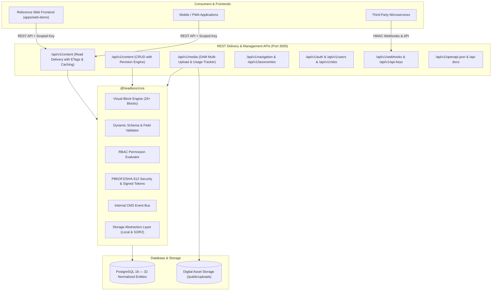

# Universal Headless CMS Platform

> A production-ready, extensible, API-first **Universal Headless CMS** built on Next.js 16, TypeScript, PostgreSQL, and Prisma. Capable of powering any modern website, mobile application, PWA, digital kiosk, or third-party digital experience.

---

## 🏛️ Architecture Overview



---

## 🚀 Key Enterprise Features

- **Content Operating System**: Not tied to a single content type. Dynamically define unlimited content models (Pages, Articles, Products, FAQs, Doctors, Events) with 25+ field types.
- **Visual Block Composer**: Nested visual block editor with 25+ blocks (Hero, Features Grid, Call to Action, Accordion FAQ, Blockquote, Columns, Markdown, Code, Gallery, Video, etc.).
- **Digital Asset Management (DAM)**: Multi-file drag-and-drop upload, folder organization, MIME validation, alt text/captions, and **Active Usage Tracking** with safe-deletion guards.
- **Enterprise Security & RBAC**: PBKDF2/SHA-512 password hashing, secure HTTP-only sessions, account lockout protection, 20+ granular permissions, built-in system roles, and custom role builder.
- **Revision History & Diffs**: Every mutation automatically snapshots a full JSON version with author attribution, diff computation, and 1-click safe rollback.
- **Editorial Workflows & Scheduling**: Multi-state workflow (Draft → In Review → Approved → Scheduled → Published → Archived) with background publishing worker.
- **REST Delivery API**: Ultra-fast read endpoints with pagination, filtering, taxonomy tags, search, and weak ETag HTTP caching.
- **Signed Preview Tokens**: HMAC-SHA256 signed preview tokens allow frontend applications to securely render unpublished drafts without leaking administrative credentials.
- **Webhook Dispatcher**: Event-driven dispatch with HMAC-SHA256 signatures, request delivery logging, and exponential backoff retries.
- **Multi-Site & Tenancy Ready**: Single CMS installation manages multiple independent domains, site brandings, and localized translation fallback chains.
- **Content Migration**: Full JSON export and schema-validated dry-run import.
- **Interactive OpenAPI 3.0 Explorer**: Built-in interactive API tester at `/api-docs`.

---

## 📂 Repository Structure

```
.
├── apps/
│   ├── admin/                # Next.js 15 Admin App & REST API Engine (Port 3000)
│   │   ├── src/app/          # App Router: Admin views & API route handlers
│   │   ├── src/components/   # shadcn/ui components, Sidebar, Header, Block Composer
│   │   ├── src/lib/          # Auth, RBAC guards, Webhooks, Scheduler, Audit logs
│   │   └── src/app.test.ts   # Integration verification test suite
│   │
│   └── web-demo/             # Decoupled Reference Frontend (Port 3001)
│       ├── src/app/          # Homepage, Articles, Article Detail, Draft Preview
│       ├── src/components/   # Frontend block renderer
│       └── src/lib/          # Pure decoupled CMS API client
│
├── packages/
│   ├── database/             # Prisma ORM, 32 normalized schemas, seed scripts
│   └── core/                 # Cryptography, RBAC evaluator, Block types, Validators
│
├── progress.md               # Continuous implementation progress tracker
├── docker-compose.yml        # Docker deployment stack (Postgres + Redis + Admin)
└── .env.example              # Environment variables template
```

---

## 🛠️ Quick Start Guide

### 1. Prerequisites
- **Node.js**: v18+ (tested on Node v24 LTS)
- **pnpm**: v9+ (or `npm`)
- **PostgreSQL**: v14+ running locally on port 5432

### 2. Environment Setup
Clone the repository and copy the environment configuration:
```bash
cp .env.example .env
```
Ensure `DATABASE_URL` points to your PostgreSQL instance:
```env
DATABASE_URL="postgresql://postgres@localhost:5432/headless_cms?schema=public"
```

### 3. Install Dependencies & Build
```bash
pnpm install
```

### 4. Push Database Schema & Seed Data
```bash
# Push normalized Prisma schema to PostgreSQL
pnpm db:push

# Populate default sites, roles, admin users, content models, entries, and menus
pnpm db:seed
```

### 5. Start Development Servers
Run the Admin CMS:
```bash
pnpm dev:admin
# Admin Panel & REST API running on http://localhost:3000
```

Run the Reference Frontend:
```bash
pnpm dev:web
# Decoupled consumer running on http://localhost:3001
```

---

## 🔐 Default Credentials & Seed Users

The seed script creates initial users for all primary editorial roles with password `AdminPass123!`:

| Email | Role | Capabilities |
| :--- | :--- | :--- |
| `admin@headless.io` | Super Administrator | Full access to all sites, users, roles, settings |
| `editor@headless.io` | Content Editor | Create, edit, approve, schedule, and publish content |
| `author@headless.io` | Staff Author | Create and edit own content drafts, upload media |
| `reviewer@headless.io` | Chief Reviewer | Review and approve content submissions |

*(The login screen also includes convenient 1-click role preset fill buttons for development).*

---

## 📡 API Quick Reference

### Public Content Delivery API
```http
GET /api/v1/content?type=articles&limit=10
GET /api/v1/content/:slug
GET /api/v1/navigation/main-navigation
GET /api/v1/search?q=architecture
GET /sitemap.xml
GET /robots.txt
```

### Draft Preview with Signed Token
```http
GET /api/v1/content/:id?previewToken={signed_hmac_token}
```

### Content Management API (Authorized)
```http
POST /api/v1/content
PATCH /api/v1/content/:id
POST /api/v1/content/:id/publish
POST /api/v1/content/:id/schedule
POST /api/v1/content/:id/revisions/:version/restore
DELETE /api/v1/content/:id
```

### Digital Asset Management (DAM)
```http
POST /api/v1/media/upload   # Multipart form upload
DELETE /api/v1/media/:id    # Protected against deletion if actively referenced
```

---

## 🧪 Running Automated Tests

Run the complete test suite across packages:
```bash
# Run Core unit tests (Security, RBAC, Validation, Block engine, Diffs)
pnpm --filter @headless/core test

# Run Admin Integration & API tests (Database, Workflows, Publishing, Revisions)
pnpm --filter @headless/admin test
```
